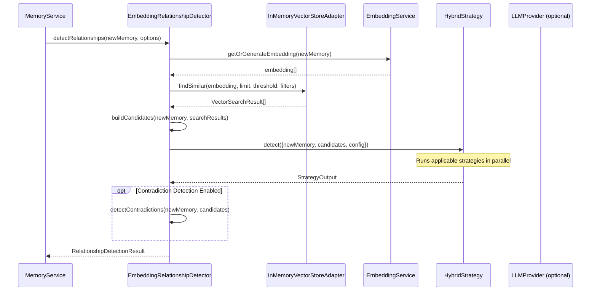

# ADR-001: Embedding-Based Relationship Detection Architecture

## Status
**Implemented** (with enhancement recommendations)

## Summary

This ADR documents the embedding-based relationship detection architecture that has been implemented in `src/services/relationships/`. It also provides recommendations for future enhancements.

## Context

### Original Problem

The original implementation in `src/services/memory.service.ts:226-304` used regex patterns and Jaccard similarity for relationship detection between memories. This approach had several limitations:

1. **Regex patterns are brittle** - They only match explicit linguistic markers (e.g., "update", "correction") and miss semantic relationships
2. **Jaccard similarity is shallow** - Word overlap does not capture semantic meaning
3. **No temporal awareness** - Recent memories are not weighted more heavily as potential updates
4. **Linear comparison** - Compares against all memories, O(n) for each new memory
5. **No contradiction detection** - Cannot identify when memories semantically contradict each other

### Solution Implemented

An **Embedding-Based Relationship Detection** system has been implemented that:

1. Uses vector embeddings for semantic similarity computation via `EmbeddingService`
2. Provides multiple detection strategies (similarity, temporal, entity overlap, LLM verification)
3. Integrates with `InMemoryVectorStoreAdapter` for efficient candidate retrieval
4. Provides optional LLM verification for high-confidence relationship classification
5. Supports temporal weighting for update detection
6. Detects contradictions between memories

## Current Implementation

### File Structure

```
src/services/relationships/
  types.ts       - Type definitions, interfaces, and configuration
  detector.ts    - EmbeddingRelationshipDetector main class
  strategies.ts  - Detection strategies (Similarity, Temporal, Entity, LLM, Hybrid)
  index.ts       - Module exports and factory functions
```

### Architecture Overview

```
+---------------------------+
|     MemoryService         |
|  (Orchestration Layer)    |
+---------------------------+
            |
            v
+---------------------------+
| EmbeddingRelationship     |
| Detector                  |
+---------------------------+
            |
    +-------+-------+-------+-------+
    |       |       |       |       |
    v       v       v       v       v
+------+ +------+ +------+ +------+ +------+
|Simil.| |Temp. | |Entity| | LLM  | |Hybrid|
|Strat.| |Strat.| |Strat.| |Strat.| |Strat.|
+------+ +------+ +------+ +------+ +------+
            |
            v
+---------------------------+
| InMemoryVectorStoreAdapter|
|  (Candidate Retrieval)    |
+---------------------------+
            |
            v
+---------------------------+
|    MemoryRepository       |
|  (Persistence Layer)      |
+---------------------------+
```

### Key Components (As Implemented)

#### 1. Detection Strategies (`strategies.ts`)

| Strategy | Purpose | When Applied |
|----------|---------|--------------|
| `SimilarityStrategy` | Pure cosine similarity thresholds | Always |
| `TemporalStrategy` | Time-based relationship inference | When `temporalWeight > 0` |
| `EntityOverlapStrategy` | Shared entity detection | When `entityOverlapWeight > 0` |
| `LLMVerificationStrategy` | LLM-based classification | When `enableLLMVerification && llmProvider` |
| `HybridStrategy` | Combines all applicable strategies | Default |

#### 2. EmbeddingRelationshipDetector (`detector.ts`)

- Main orchestrator class
- Integrates with `EmbeddingService` for embedding generation
- Uses `InMemoryVectorStoreAdapter` for candidate retrieval
- Provides caching with configurable TTL
- Supports batch processing

#### 3. VectorStore Interface (`types.ts`)

```typescript
interface VectorStore {
  findSimilar(
    embedding: number[],
    limit: number,
    threshold: number,
    filters?: { containerTag?: string; excludeIds?: string[] }
  ): Promise<VectorSearchResult[]>;
}
```

#### 4. LLMProvider Interface (`types.ts`)

```typescript
interface LLMProvider {
  verifyRelationship(request: LLMVerificationRequest): Promise<LLMVerificationResponse>;
  checkContradiction(content1: string, content2: string): Promise<ContradictionResult>;
}
```

## Configuration (As Implemented)

### Default Thresholds

```typescript
const DEFAULT_RELATIONSHIP_CONFIG: RelationshipConfig = {
  thresholds: {
    updates: 0.85,      // Very similar content, likely an update
    extends: 0.70,      // High similarity with additional content
    contradicts: 0.80,  // High similarity but opposing content
    supersedes: 0.90,   // Near-identical, explicit replacement
    related: 0.60,      // Meaningful semantic relationship
    derives: 0.65,      // Moderate similarity, causal relationship
  },
  maxCandidates: 50,
  enableLLMVerification: false,
  llmVerificationThreshold: 0.85,
  temporalWeight: 0.1,
  entityOverlapWeight: 0.2,
  enableContradictionDetection: true,
  batchSize: 10,
  cacheTTL: 5 * 60 * 1000, // 5 minutes
  enableCausalDetection: true,
};
```

### Threshold Rationale

| Threshold | Value | Rationale |
|-----------|-------|-----------|
| `supersedes` | 0.90 | Near-identical content indicates explicit replacement |
| `updates` | 0.85 | Very high similarity with modification indicators |
| `contradicts` | 0.80 | High similarity needed to ensure same topic |
| `extends` | 0.70 | Moderate similarity with additional detail |
| `derives` | 0.65 | Lower threshold for causal relationships |
| `related` | 0.60 | Minimum for meaningful semantic connection |

## Usage Examples

### Basic Usage

```typescript
import {
  createEmbeddingRelationshipDetector,
  getRelationshipDetector,
  indexMemoryForRelationships,
} from './services/relationships/index.js';
import { getEmbeddingService } from './services/embedding.service.js';

// Option 1: Use singleton
const detector = getRelationshipDetector(getEmbeddingService());

// Option 2: Create standalone instance
const detector = createEmbeddingRelationshipDetector(embeddingService);

// Detect relationships for a new memory
const result = await detector.detectRelationships(newMemory, {
  containerTag: 'user-123',
});

console.log(`Found ${result.relationships.length} relationships`);
console.log(`Superseded memories: ${result.supersededMemoryIds.join(', ')}`);
console.log(`Contradictions: ${result.contradictions.length}`);
```

### Batch Processing

```typescript
const results = await detector.batchDetectRelationships(memories, {
  containerTag: 'user-123',
});
```

### Contradiction Detection

```typescript
const contradictions = await detector.detectContradictionsInGroup(memories);
```

### Indexing Memories

```typescript
// Index a memory for future relationship detection
await indexMemoryForRelationships(memory, embedding, embeddingService);
```

## Detection Flow



## Integration Points

### 1. MemoryService Integration

The `MemoryService.detectRelationships()` method should be updated to use the new detector:

```typescript
// In memory.service.ts
import { getRelationshipDetector } from './relationships/index.js';

async detectRelationships(
  newMemory: Memory,
  existingMemories: Memory[]
): Promise<Relationship[]> {
  const detector = getRelationshipDetector(this.embeddingService);

  const result = await detector.detectRelationships(newMemory, {
    containerTag: newMemory.containerTag,
  });

  return result.relationships.map(rel => ({
    id: generateId(),
    sourceMemoryId: rel.relationship.sourceMemoryId,
    targetMemoryId: rel.relationship.targetMemoryId,
    type: rel.relationship.type,
    confidence: rel.relationship.confidence,
    description: rel.relationship.description,
    createdAt: new Date(),
    metadata: rel.relationship.metadata,
  }));
}
```

### 2. SearchService Integration

The detector uses the same `VectorStore` interface as the search service:

```typescript
// Share vector store between search and relationship detection
const sharedVectorStore = getSharedVectorStore();

// Index memory for both search and relationships
await searchService.indexMemory(memory, chunks);
await indexMemoryForRelationships(memory, memory.embedding, embeddingService);
```

## Performance Characteristics

### Current Implementation

| Operation | Complexity | Notes |
|-----------|------------|-------|
| Candidate retrieval | O(n) | Linear scan in InMemoryVectorStoreAdapter |
| Embedding generation | O(1) per memory | API call to OpenAI or local TF-IDF |
| Strategy execution | O(k) | k = number of candidates |
| Contradiction detection | O(n^2) | Pairwise comparison |

### Built-in Optimizations

1. **Caching**: Relationship scores cached with configurable TTL (default 5 min)
2. **Batching**: Batch processing with configurable batch size
3. **Early termination**: Skip candidates below threshold
4. **Parallel strategies**: Hybrid strategy runs applicable strategies in parallel

### Recommendations for Production

1. **Replace InMemoryVectorStoreAdapter** with a proper vector database (Pinecone, Qdrant, Weaviate)
2. **Implement persistent caching** using Redis or database-backed cache
3. **Add embedding persistence** to avoid regenerating embeddings
4. **Use approximate nearest neighbors** for O(log n) candidate retrieval

## Enhancement Recommendations

### P1: Critical Improvements

1. **LLM Provider Implementation**
   - The `LLMProvider` interface is defined but not implemented
   - Implement using OpenAI API for relationship verification
   - Add rate limiting and cost tracking

2. **Vector Store Persistence**
   - Replace `InMemoryVectorStoreAdapter` with SQLite-backed store
   - Integrate with existing `embeddings` table in schema

3. **MemoryService Integration**
   - Update `MemoryService.detectRelationships()` to use new detector
   - Maintain backward compatibility with existing API

### P2: Important Enhancements

1. **Threshold Tuning**
   - Add configuration UI for threshold adjustment
   - Implement A/B testing framework for threshold optimization
   - Add telemetry for relationship detection accuracy

2. **Contradiction Resolution**
   - Implement automatic resolution suggestions
   - Add user feedback loop for resolution learning
   - Track resolution history

3. **Performance Monitoring**
   - Add metrics for detection latency
   - Track cache hit rates
   - Monitor embedding API usage

### P3: Nice-to-Have Features

1. **Relationship Graph Visualization**
   - Build graph representation of memory relationships
   - Implement graph traversal for related memory discovery

2. **Cross-Container Relationships**
   - Detect relationships across container boundaries
   - Add privacy controls for cross-container detection

3. **Bulk Relationship Analysis**
   - Periodic background job for relationship discovery
   - Identify clusters of related memories

## Testing Strategy

### Unit Tests

```typescript
describe('SimilarityStrategy', () => {
  it('should detect updates when similarity >= 0.85', async () => {
    // ...
  });

  it('should detect extensions when similarity >= 0.70 with extension indicators', async () => {
    // ...
  });
});
```

### Integration Tests

```typescript
describe('EmbeddingRelationshipDetector', () => {
  it('should detect relationships for new memory', async () => {
    // Setup vector store with existing memories
    // Add new memory
    // Verify relationships detected correctly
  });
});
```

### Benchmark Tests

```typescript
describe('Performance', () => {
  it('should process 1000 memories in < 5 seconds', async () => {
    // ...
  });
});

## Consequences

### Positive
- More accurate semantic relationship detection than regex-based approach
- Handles synonyms, paraphrasing, and semantic equivalence
- Configurable thresholds for tuning precision/recall tradeoff
- Clean separation of concerns with strategy pattern
- Extensible for LLM verification
- Built-in caching for performance
- Comprehensive contradiction detection

### Negative
- Requires embedding computation (added latency ~100-500ms per memory)
- Memory overhead for embedding storage (1536 dimensions * 4 bytes = 6KB per memory)
- Increased complexity compared to regex approach
- Dependency on OpenAI API for best accuracy

### Mitigations
- Use batch embedding for bulk memory operations
- Cache embeddings in memory and persist to DB
- Lazy embedding generation (only when needed)
- Local TF-IDF fallback when OpenAI unavailable
- Configurable batch sizes to control memory usage

## Decision Log

| Date | Decision | Rationale |
|------|----------|-----------|
| 2026-02-01 | Implemented strategy pattern | Allows swapping detection algorithms without changing API |
| 2026-02-01 | Used InMemoryVectorStoreAdapter | Simple implementation for MVP, production should use proper vector DB |
| 2026-02-01 | Made LLM verification optional | Performance concern; can be enabled for high-value relationships |
| 2026-02-01 | Added HybridStrategy as default | Combines best of all approaches |

## References

- OpenAI text-embedding-3-small documentation
- "Semantic Similarity in Sentences" (Reimers & Gurevych, 2019)
- "Dense Passage Retrieval for Open-Domain Question Answering" (Karpukhin et al., 2020)
- Project codebase: `src/services/relationships/`

## Appendix: API Reference

### Factory Functions

```typescript
// Get singleton detector (requires embeddingService on first call)
getRelationshipDetector(embeddingService?, config?): EmbeddingRelationshipDetector

// Create standalone instance
createRelationshipDetector(embeddingService, options?): EmbeddingRelationshipDetector

// Reset singleton (for testing)
resetRelationshipDetector(): void

// Get shared vector store
getSharedVectorStore(): InMemoryVectorStoreAdapter
```

### EmbeddingRelationshipDetector Methods

```typescript
// Main detection
detectRelationships(memory, options?): Promise<RelationshipDetectionResult>

// Batch detection
batchDetectRelationships(memories, options?): Promise<RelationshipDetectionResult[]>

// Contradiction detection
detectContradictions(memory, candidates): Promise<Contradiction[]>
detectContradictionsInGroup(memories): Promise<Contradiction[]>

// Configuration
getConfig(): RelationshipConfig
updateConfig(updates): void
setLLMProvider(provider): void

// Caching
getCachedScore(sourceId, targetId): CachedRelationshipScore | null
cacheScore(sourceId, targetId, score, type): void
clearCache(): void
getCacheStats(): { size: number; oldestEntry: number | null }
```

### Convenience Functions

```typescript
// Quick relationship detection (uses singleton)
detectRelationshipsQuick(memory, embeddingService?, containerTag?): Promise<RelationshipDetectionResult>

// Quick batch detection
batchDetectRelationshipsQuick(memories, embeddingService?, containerTag?): Promise<RelationshipDetectionResult[]>

// Quick contradiction detection
detectContradictionsQuick(memories, embeddingService?): Promise<Contradiction[]>

// Memory indexing
indexMemoryForRelationships(memory, embedding?, embeddingService?): Promise<void>
removeMemoryFromRelationshipIndex(memoryId): boolean
clearRelationshipIndex(): void
```
