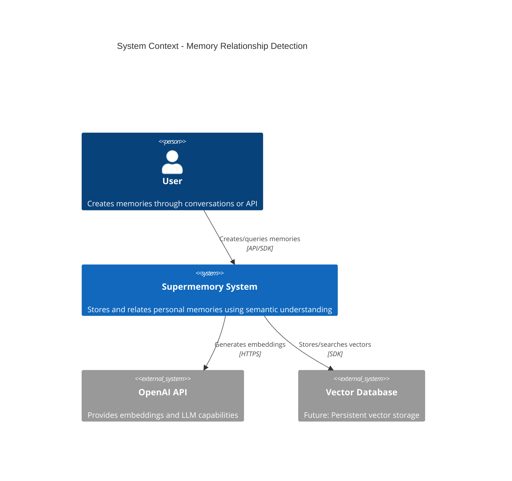
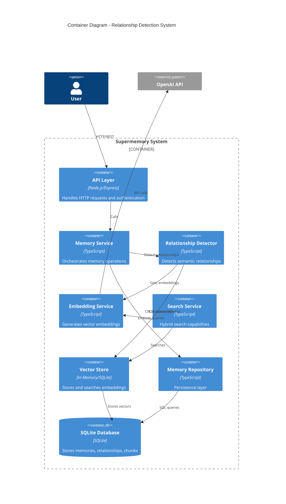
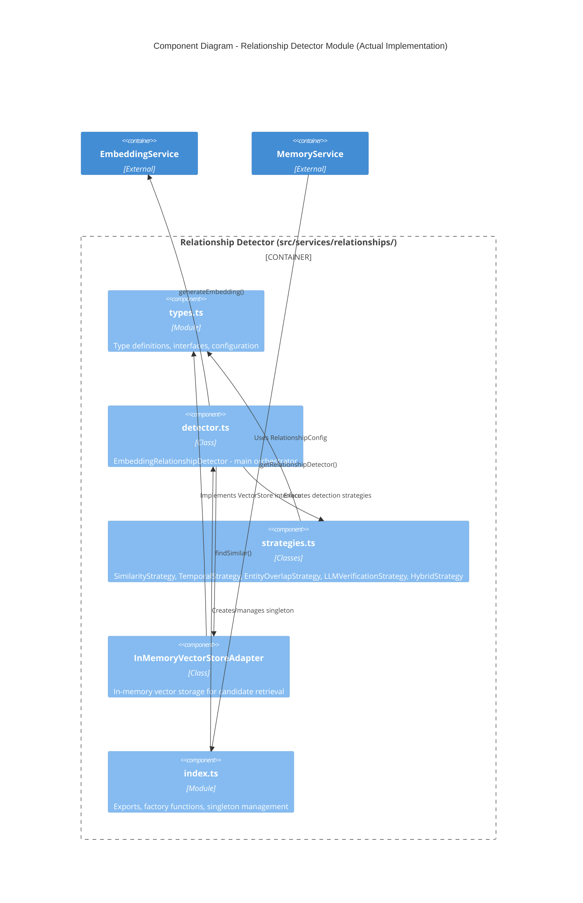
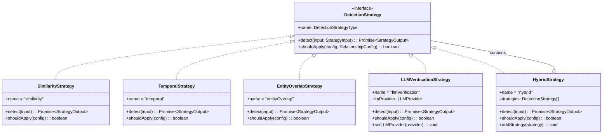
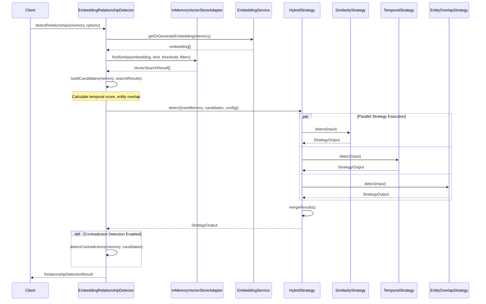
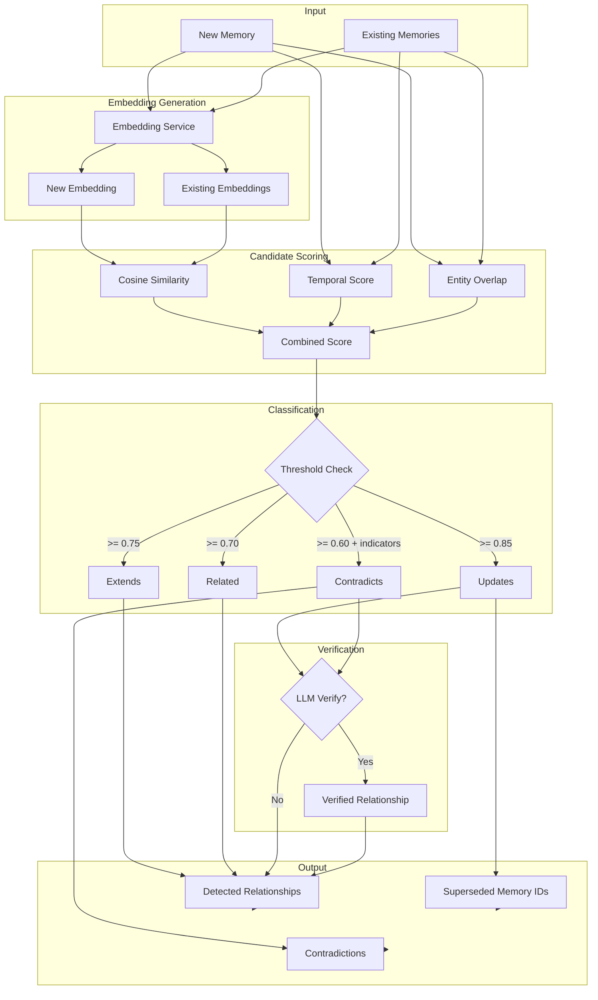
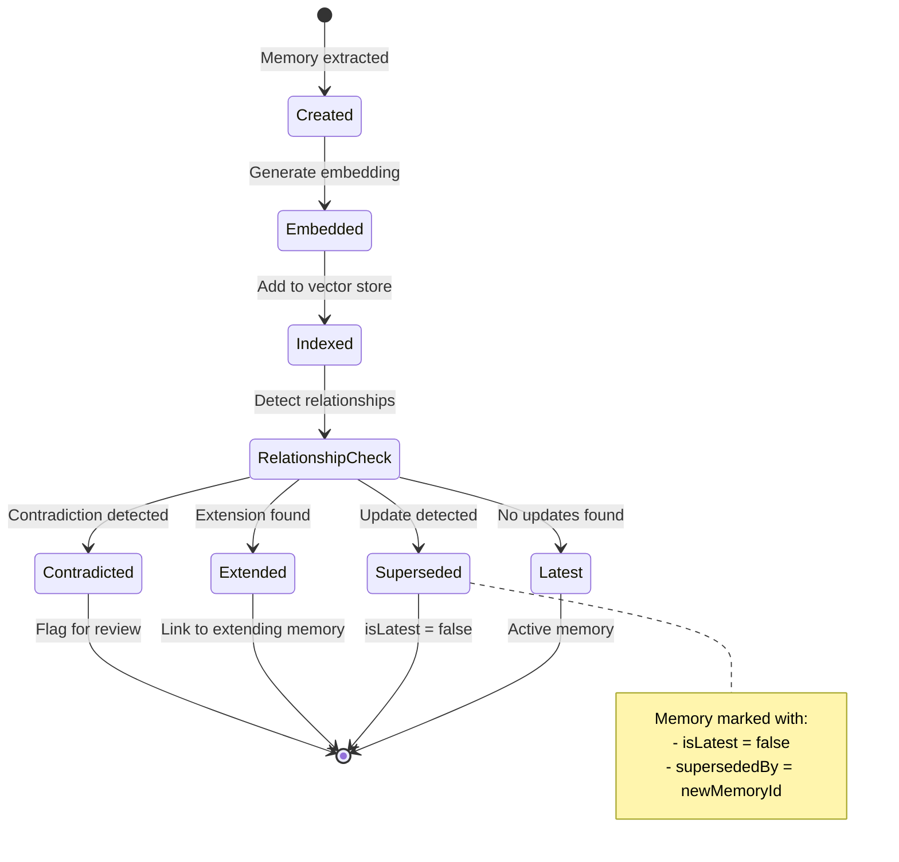
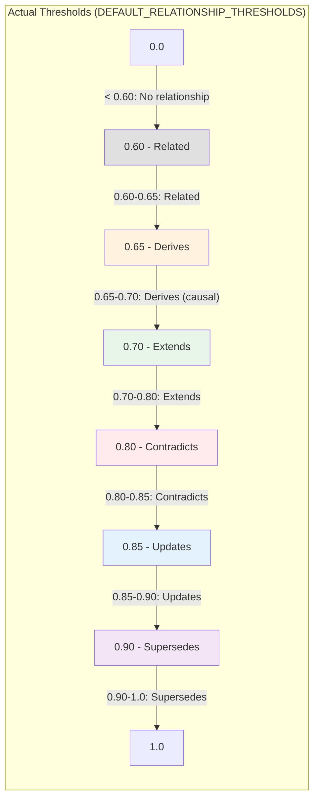
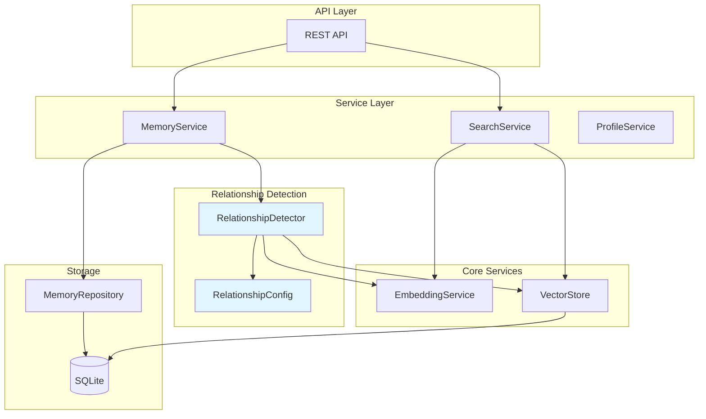

# Relationship Detection - C4 Architecture Diagrams

> Status: **Implemented** - These diagrams reflect the current implementation in `src/services/relationships/`

## Level 1: System Context



## Level 2: Container Diagram



## Level 3: Component Diagram - Relationship Detector (As Implemented)



## Strategy Pattern (As Implemented)



## Level 4: Code Diagram - Detection Flow (As Implemented)



## Data Flow Diagram



## State Diagram - Memory Lifecycle



## Threshold Configuration Visualization (As Implemented)



## Integration Architecture



## File Structure

```
src/services/relationships/
    types.ts        - Type definitions, interfaces, configuration constants
                      - RelationshipConfig, RelationshipThresholds
                      - DetectedRelationship, Contradiction
                      - VectorStore, LLMProvider interfaces
                      - generateCacheKey utility

    strategies.ts   - Detection strategy implementations
                      - SimilarityStrategy (cosine similarity thresholds)
                      - TemporalStrategy (time-based inference)
                      - EntityOverlapStrategy (shared entity detection)
                      - LLMVerificationStrategy (LLM classification)
                      - HybridStrategy (combines all strategies)
                      - createStrategy, createDefaultStrategy factories

    detector.ts     - Main detector class
                      - EmbeddingRelationshipDetector
                      - InMemoryVectorStoreAdapter
                      - Caching, batch processing
                      - Contradiction detection

    index.ts        - Module exports and factories
                      - getRelationshipDetector singleton
                      - createRelationshipDetector factory
                      - Convenience functions (detectRelationshipsQuick, etc.)
                      - Integration helpers (indexMemoryForRelationships, etc.)
```

## Key Metrics

| Metric | Value | Notes |
|--------|-------|-------|
| Lines of Code | ~1,100 | Across 4 files |
| Detection Strategies | 5 | Similarity, Temporal, Entity, LLM, Hybrid |
| Relationship Types | 6 | updates, extends, derives, contradicts, related, supersedes |
| Default Thresholds | 6 | 0.60 to 0.90 |
| Cache TTL | 5 min | Configurable |
