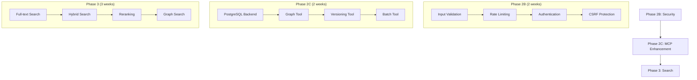

# Implementation Plan: Agent CLI Integration

**Created:** February 3, 2026  
**Status:** Ready to Execute  
**Priority:** P0 (Critical Path)

---

## Executive Summary

This plan outlines the steps to fully integrate supermemory-clone with agent CLI tools like claude-code, ensuring production-ready MCP server capabilities.

---

## Current State

### Implemented ✅
- MCP Server with 7 tools and 5 resource types
- Stdio transport for claude-code
- Semantic search with embeddings
- Profile management with remember/recall
- Basic persistence (JSON file)

### Gaps Identified ⚠️
- No PostgreSQL backend for MCP (uses JSON file)
- No authentication/authorization in MCP
- No rate limiting in MCP
- Missing relationship traversal tool
- Missing memory versioning tool
- No batch operations

---

## Implementation Phases

### Phase 2B: Security Hardening (2 weeks)
**Priority:** P0 | **Blocking:** Production deployment

#### Week 1: Input Validation & Sanitization
| Task | Priority | Effort | Description |
|------|----------|--------|-------------|
| TASK-052 | P0 | M | Zod schema validation for all inputs |
| XSS Sanitization | P0 | S | DOMPurify for HTML content |
| SQL Prevention | P0 | S | Verify all queries parameterized |
| Path Traversal | P0 | S | Validate all file paths |

#### Week 2: Authentication & Rate Limiting
| Task | Priority | Effort | Description |
|------|----------|--------|-------------|
| TASK-053 | P0 | S | Rate limiting for MCP server |
| TASK-054 | P0 | M | API key authentication |
| TASK-055 | P0 | S | CSRF protection |
| TASK-056 | P1 | M | Secrets management |

### Phase 2C: MCP Enhancement (1-2 weeks)
**Priority:** P1 | **Dependencies:** Phase 2B

#### Week 3: PostgreSQL Backend
| Task | Priority | Effort | Description |
|------|----------|--------|-------------|
| TASK-057 | P0 | M | Connect MCP to PostgreSQL |
| Migration | P1 | S | JSON to PostgreSQL migration tool |
| Testing | P1 | M | Integration tests for MCP+PostgreSQL |

#### Week 4: New MCP Tools
| Task | Priority | Effort | Description |
|------|----------|--------|-------------|
| TASK-058 | P1 | M | Relationship traversal tool |
| TASK-059 | P1 | S | Memory versioning tool |
| TASK-060 | P1 | M | Batch operations tool |

### Phase 3: Search Enhancement (2-3 weeks)
**Priority:** P0 | **Dependencies:** Phase 2C

| Task | Priority | Effort | Description |
|------|----------|--------|-------------|
| TASK-011 | P0 | M | Full-text keyword search |
| TASK-012 | P0 | L | Hybrid search with RRF |
| TASK-014 | P1 | M | Cross-encoder reranking |
| TASK-015 | P1 | L | Graph traversal search |

---

## Implementation Order

---

## Quick Wins (Can do now, <1 day each)

1. **Add supermemory_get_document tool**
   - Direct document retrieval by ID
   - Copy pattern from supermemory_list
   - Effort: 2 hours

2. **Add supermemory_stats tool**
   - Quick stats without resource lookup
   - Copy from stats resource handler
   - Effort: 1 hour

3. **Improve tool descriptions**
   - Better descriptions for LLM understanding
   - Add examples in descriptions
   - Effort: 2 hours

4. **Add example configurations**
   - docs/mcp-setup.md with claude-code examples
   - Environment variable reference
   - Effort: 3 hours

5. **Add MCP health check**
   - Simple ping/pong tool
   - Verify services are running
   - Effort: 30 minutes

---

## Success Metrics

### Phase 2B (Security)
| Metric | Target |
|--------|--------|
| P0 Security Issues | 0 remaining |
| Input Validation | 100% coverage |
| Rate Limiting | Enabled on all tools |
| Auth Required | All MCP tools |

### Phase 2C (MCP Enhancement)
| Metric | Target |
|--------|--------|
| PostgreSQL Backend | 100% integrated |
| New Tools | 3 added (graph, version, batch) |
| Test Coverage | >90% for MCP |
| Response Time | <100ms for simple ops |

### Phase 3 (Search)
| Metric | Target |
|--------|--------|
| Full-text Latency | <50ms |
| Hybrid Latency | <150ms |
| With Reranking | <300ms |
| Recall Improvement | +20% over vector-only |

---

## Risk Mitigation

| Risk | Probability | Impact | Mitigation |
|------|-------------|--------|------------|
| PostgreSQL migration breaks MCP | Medium | High | JSON fallback, staged rollout |
| Auth breaks existing integrations | Medium | Medium | Optional auth flag initially |
| Rate limiting too aggressive | Low | Medium | Configurable limits per container |
| Performance regression | Low | High | Benchmark before/after each phase |

---

## Timeline Summary

| Phase | Duration | Start | End |
|-------|----------|-------|-----|
| **Phase 2B** | 2 weeks | Week 1 | Week 2 |
| **Phase 2C** | 2 weeks | Week 3 | Week 4 |
| **Phase 3** | 3 weeks | Week 5 | Week 7 |
| **Total** | 7 weeks | - | - |

---

## Next Actions

### Immediate (Today)
1. ✅ Create implementation plan (this document)
2. ✅ Update BACKLOG.md with new tasks
3. ⏳ Complete gap analysis
4. ⏳ Add quick wins (5 items)

### This Week
1. Start TASK-052: Input validation framework
2. Start TASK-053: Rate limiting for MCP
3. Review and prioritize gap analysis findings
4. Create test plan for security changes

### Next Week
1. Complete authentication (TASK-054)
2. Add CSRF protection (TASK-055)
3. Begin PostgreSQL backend migration

---

## Resources Required

### Development
- 1 developer full-time for 7 weeks
- OR 2 developers for 4 weeks (parallel tracks)

### Infrastructure
- PostgreSQL 16+ (already available)
- Redis for rate limiting (already available)
- Test environment with isolated data

### External Dependencies
- OpenAI API for embeddings (already integrated)
- @modelcontextprotocol/sdk (already using v1.25.3)

---

## Approval & Sign-off

- [ ] Technical Lead review
- [ ] Security review for Phase 2B
- [ ] Performance baseline established
- [ ] Test plan approved

---

**Document Status:** Ready for Execution  
**Last Updated:** February 3, 2026  
**Owner:** Development Team
